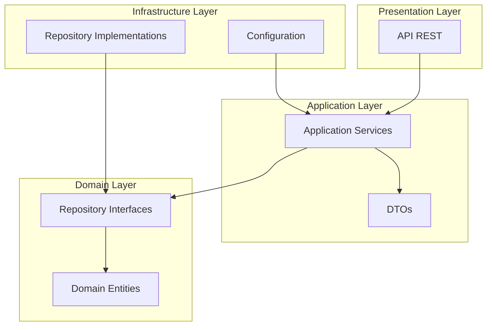

# blue-bird
Challenge Ualá

## Tecnologías y Herramientas

### Backend
- **Java 17**: Lenguaje de programación principal
- **Spring Boot**: Framework para desarrollo de aplicaciones Java
- **Spring Data JPA**: Para la persistencia de datos
- **PostgreSQL**: Base de datos relacional
- **Docker**: Para containerización de la aplicación
- **Docker Compose**: Para orquestación de contenedores
- **Maven**: Gestor de dependencias y build tool

### Herramientas de Desarrollo
- **IntelliJ IDEA**: IDE recomendado
- **Git**: Control de versiones
- **Postman**: Para pruebas de API

### Testing
- **JUnit 5**: Framework de testing
- **Mockito**: Para mocking en tests
- **Spring Test**: Para testing de componentes Spring

### Documentación
- **Swagger/OpenAPI**: Documentación de la API

## Arquitectura

La solución está estructurada siguiendo los principios de Clean Architecture, dividiendo la aplicación en capas bien definidas:



### Capas de la Aplicación

1. **Presentation Layer**
   - Contiene los controladores REST que exponen los endpoints de la API
   - Maneja las peticiones HTTP y las respuestas

2. **Application Layer**
   - Implementa la lógica de negocio de la aplicación
   - Define los servicios que orquestan las operaciones
   - Contiene los DTOs para transferencia de datos

3. **Domain Layer**
   - Contiene las entidades del dominio
   - Define las interfaces de los repositorios
   - Implementa la lógica de negocio core

4. **Infrastructure Layer**
   - Implementa las interfaces definidas en el dominio
   - Contiene la configuración de la aplicación
   - Maneja la persistencia de datos y servicios externos

### Estructura de Directorios

```
src/main/java/com/julibenitez/bluebird/
├── application/     # Capa de aplicación
├── domain/         # Capa de dominio
├── infrastructure/ # Capa de infraestructura
└── configuration/  # Configuración de la aplicación
```
