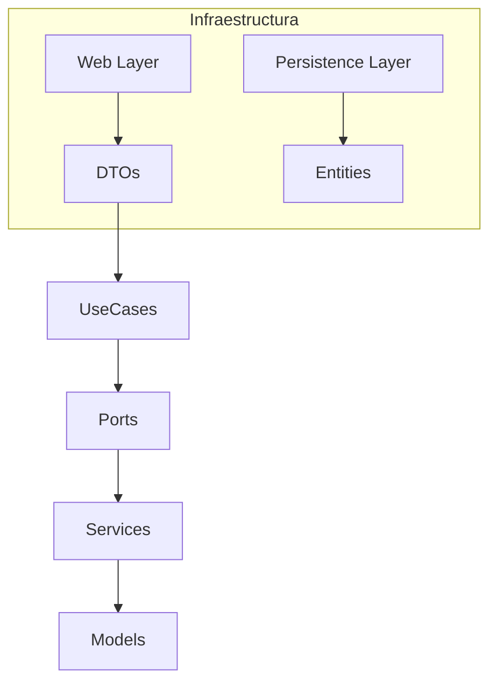

# BlueBird - Clone de Twitter

 

## 📋 Tabla de Contenido

- [Descripción](#descripción)
- [Características](#características)
- [Arquitectura](#arquitectura)
- [Tecnologías](#tecnologías)
- [Requisitos Previos](#requisitos-previos)
- [Instalación](#instalación)
- [Configuración](#configuración)
- [Ejecución](#ejecución)
- [Uso](#uso)
- [API](#api)
- [Testing](#testing)
- [Estructura del Proyecto](#estructura-del-proyecto)
- [Contribución](#contribución)
- [Licencia](#licencia)
- [Autores](#autores)

## 🔍 Descripción

BlueBird es una aplicación web inspirada en Twitter que permite a los usuarios:

- Crear y publicar tweets (máximo 280 caracteres).
- Seguir a otros usuarios.
- Consultar su timeline personalizado con los tweets de quienes siguen.
- Procesamiento asíncrono de mensajes mediante AWS SQS.

Este proyecto forma parte del challenge técnico de Ualá.

## 🚀 Características

- **Tweets**: creación y listado de tweets.
- **Sistema de seguidores**: seguir/seguir usuarios.
- **Timeline personalizado**.
- **Integración con AWS SQS** para mensajería asíncrona.
- **API RESTful** para todas las operaciones.
- **Persistencia** en PostgreSQL.

## 🏗️ Arquitectura

El proyecto utiliza una **arquitectura hexagonal** (puertos y adaptadores):

- **Dominio** (`domain/`): entidades, servicios, puertos e excepciones.
- **Aplicación** (`application/`): casos de uso que orquestan la lógica.
- **Infraestructura** (`infrastructure/`): persistencia (JPA), API web (Controllers), mensajería (Listeners y Publishers).
- **DTOs** (`dtos/`): objetos de transferencia y mapeo de datos.



## 🛠️ Tecnologías

- Java 17
- Spring Boot 3.x
- Spring Data JPA
- Maven
- PostgreSQL
- AWS SQS
- LocalStack (desarrollo local)
- Docker & Docker Compose
- JUnit 5

## 📋 Requisitos Previos

- Java 17 o superior
- Maven 3.x
- Docker y Docker Compose
- Cuenta de AWS (solo para entornos de producción)

## ⚙️ Instalación

```bash
git clone https://github.com/JYBenitez/blue-bird.git
cd blue-bird
```

## 🔧 Configuración

1. Otorgar permisos de ejecución al script de inicialización:
   ```bash
   chmod +x init.sh
   ```
2. Ejecutar el script `init.sh` para:
   - Levantar contenedores de PostgreSQL y LocalStack.
   - Crear base de datos, tablas y datos iniciales.
   - Configurar colas SQS en LocalStack.
   ```bash
   ./init.sh
   ```

## ▶️ Ejecución

### Con Maven

```bash
mvn clean install
mvn spring-boot:run
```

## 📦 Uso

Una vez levantada la aplicación, la API estará disponible en `http://localhost:8080/api/v1`.

### Ejemplo de uso con cURL

- **Crear un tweet**

  ```bash
  curl -X POST http://localhost:8080/api/v1/tweets/{userId}        -H "Content-Type: application/json"        -d '{"content":"¡Hola, BlueBird!"}'
  ```

## 📑 API Endpoints

### Tweets

| Método | Ruta               | Descripción          |
| ------ | ------------------ | -------------------- |
| POST   | `/tweets/{userId}` | Crear un nuevo tweet |

### Seguidores

| Método | Ruta                 | Descripción         |
| ------ | -------------------- | ------------------- |
| POST   | `/follower/{userId}` | Seguir a un usuario |

## 🧪 Testing

Ejecuta todos los tests unitarios e integraciones con:

```bash
mvn test
```

## 🗂️ Estructura del Proyecto

```
blue-bird/
├── application/
├── domain/
├── dtos/
├── infrastructure/
│   ├── persistence/
│   └── web/
│       ├── controllers/
│   ├── listeners/
│   └── publishers/
├── init.sh
├── init.sql
├── Dockerfile
├── docker-compose.yml
├── connect-to-database.sh
└── pom.xml
```

## 🤝 Contribución

1. Haz un fork del repositorio
2. Crea una rama para tu feature: `git checkout -b feature/NuevaFuncionalidad`
3. Realiza tus cambios y haz commit: `git commit -m "Añade nueva funcionalidad"`
4. Envía tu rama al repositorio remoto: `git push origin feature/NuevaFuncionalidad`
5. Abre un Pull Request

## 📄 Licencia

Este proyecto está bajo la licencia **MIT**. Para más detalles, consulta el archivo [LICENSE.md](LICENSE.md).

## 🖋️ Autores

- **Julieta Benitez** - Desarrollo inicial - [GitHub](https://github.com/JYBenitez)

---

_Challenge técnico de Ualá_
