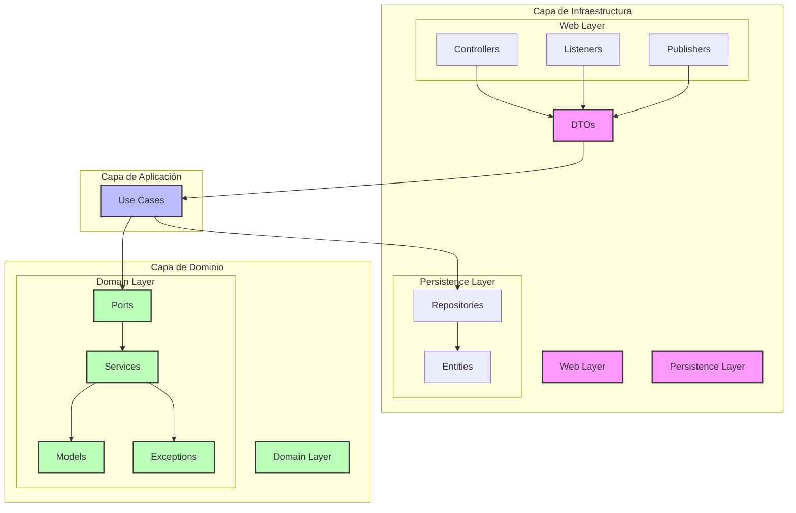

# BlueBird - Twitter Clone

BlueBird es una aplicación web que replica las funcionalidades básicas de Twitter, permitiendo a los usuarios crear tweets, seguir a otros usuarios y ver su timeline.

## 🏗️ Arquitectura

El proyecto sigue una arquitectura hexagonal (también conocida como puertos y adaptadores) con las siguientes capas:

### Dominio (`domain/`)
- **Modelos**: Entidades principales como `User`, `Tweet`, y `Follow`
- **Servicios**: Lógica de negocio para crear tweets y relaciones de seguidores
- **Puertos**: Interfaces que definen las operaciones del sistema
- **Excepciones**: Manejo de errores específicos del dominio

### Aplicación (`application/`)
- **Casos de Uso**: Implementación de la lógica de aplicación que orquesta las operaciones del sistema
  - `CreateTweetUseCase`: Creación de tweets
  - `CreateFollowerRelationshipUseCase`: Gestión de relaciones de seguidores
  - `NewTweetUseCase`: Procesamiento de nuevos tweets

### Infraestructura (`infrastructure/`)
- **Persistencia** (`persistence/`): 
  - Repositorios JPA para almacenamiento en PostgreSQL
  - Entidades y configuraciones de base de datos
- **Web** (`web/`): 
  - **Controllers**: Endpoints REST para exponer la API
  - **Listeners**: Consumidores de mensajes de AWS SQS
  - **Publishers**: Productores de mensajes para AWS SQS

### DTOs (`dtos/`)
- **Objetos de Transferencia**: `TweetRequestDto`, `TweetResponseDto`, `FollowRequestDto`
- **Mapeo de Datos**: Conversión entre entidades del dominio y objetos de transferencia

### Diagrama de Arquitectura



## 🚀 Características Principales

- Creación de tweets (máximo 280 caracteres)
- Sistema de seguidores
- Timeline personalizado
- Integración con AWS SQS para mensajería asíncrona
- API RESTful
- Persistencia en PostgreSQL

## 🛠️ Tecnologías

- Java 17
- Spring Boot 3.3.11
- Spring Data JPA
- PostgreSQL
- AWS SQS
- LocalStack (para desarrollo local)
- JUnit 5
- Maven
- Docker

## 📋 Prerrequisitos

- Java 17 o superior
- Maven
- Docker y Docker Compose
- Cuenta de AWS (solo para producción)

## 🔧 Configuración

1. Clonar el repositorio:
```bash
git clone [URL_DEL_REPOSITORIO]
cd bluebird
```

2. Configurar el ambiente local:
```bash
# Dar permisos de ejecución al script
chmod +x init.sh

# Ejecutar el script de inicialización
./init.sh
```

El script `init.sh` se encargará de:
- Levantar los contenedores de Docker necesarios:
  - PostgreSQL para la base de datos
  - LocalStack para simular servicios AWS localmente
- Crear la base de datos y las tablas
- Configurar los datos iniciales
- Configurar las colas SQS en LocalStack

3. Compilar y ejecutar:
```bash
mvn clean install
mvn spring-boot:run
```

## 📚 API Endpoints

### Tweets
- `POST /api/v1/tweets/{user_id}`: Crear un nuevo tweet
- `GET /api/v1/tweets/{user_id}`: Obtener tweets de un usuario

### Seguidores
- `POST /api/v1/follower/{user_id}`: Seguir a un usuario
- `GET /api/v1/follower/{user_id}`: Obtener seguidores de un usuario

## 🧪 Testing

El proyecto incluye tests unitarios y de integración. Para ejecutarlos:

```bash
mvn test
```

## 📦 Estructura del Proyecto

```
bluebird/
├── src/
│   ├── main/
│   │   ├── java/
│   │   │   └── com/julibenitez/bluebird/
│   │   │       ├── application/
│   │   │       │   └── usecase/
│   │   │       ├── domain/
│   │   │       ├── infrastructure/
│   │   │       │   ├── persistence/
│   │   │       │   └── web/
│   │   │       │       ├── controllers/
│   │   │       │       ├── listeners/
│   │   │       │       └── publishers/
│   │   │       ├── dtos/
│   │   │       └── BluebirdApplication.java
│   │   └── resources/
│   └── test/
├── pom.xml
└── README.md
```

## 🤝 Contribución

1. Fork el proyecto
2. Crea una rama para tu feature (`git checkout -b feature/AmazingFeature`)
3. Commit tus cambios (`git commit -m 'Add some AmazingFeature'`)
4. Push a la rama (`git push origin feature/AmazingFeature`)
5. Abre un Pull Request

## 📝 Licencia

Este proyecto está bajo la Licencia MIT - ver el archivo [LICENSE.md](LICENSE.md) para más detalles.

## 👥 Autores

- Julieta Benitez - *Desarrollo inicial* - [GitHub](https://github.com/tu-usuario) 